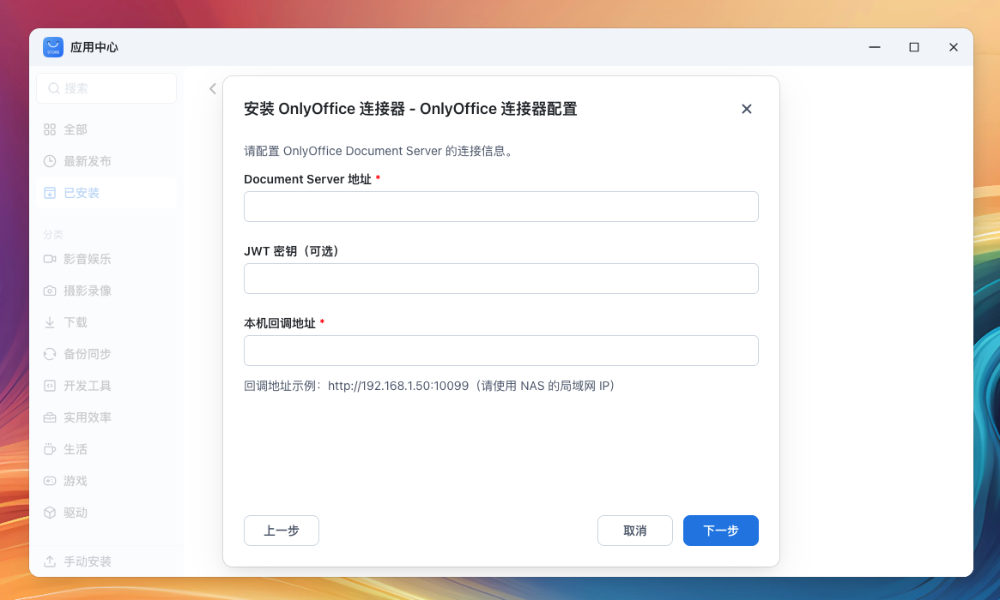

# OnlyOffice fnOS Connector

在浏览器中直接编辑 NAS 上的 Office 文档。支持 DOCX、XLSX、PPTX 等格式的在线编辑，以及 DOC、XLS、PPT、ODT、ODS、ODP 等格式的转换和查看。



## 功能特性

- **在线编辑**: 直接在浏览器中编辑 DOCX、XLSX、PPTX 文档
- **格式转换**: 自动将旧格式 (DOC/XLS/PPT) 转换为 OOXML 格式
- **文档查看**: 支持 PDF、EPUB、FB2 等格式的在线预览
- **JWT 安全**: 支持 JWT 签名验证，确保文档传输安全
- **fnOS 集成**: 专为飞牛 NAS (fnOS) 设计的应用连接器

## 支持的文件格式

| 类型 | 可编辑 | 可转换 | 仅查看 |
|------|--------|--------|--------|
| 文档 | docx | doc, odt, rtf, txt | pdf, djvu, epub, fb2 |
| 表格 | xlsx | xls, ods, csv | - |
| 演示 | pptx | ppt, odp | - |

## 安装部署

### 1. 使用 Docker Compose 一键部署

复制 `.env.example` 为 `.env` 并配置外网域名：

```bash
cp .env.example .env
```

编辑 `.env` 文件：

```bash
# 外网域名后缀，用于判断是否走 HTTPS
# 匹配 *.example.com 和 example.com
EXTERNAL_DOMAIN=.your-domain.com
```

启动所有服务：

```bash
docker compose up -d
```

这会启动三个容器：
- `onlyoffice-nginx`: 反向代理入口 (端口 9080)
- `onlyoffice-connector`: 连接器服务
- `onlyoffice-doc-svr`: OnlyOffice Document Server

### 2. 访问服务

- 内网访问: `http://your-nas-ip:9080/editor?path=/path/to/file.docx`
- 外网访问: `https://your-domain.com:9080/editor?path=/path/to/file.docx`

nginx 会根据域名自动判断协议：
- 匹配 `EXTERNAL_DOMAIN` 的请求 → `X-Forwarded-Proto: https`
- 其他请求（内网 IP）→ `X-Forwarded-Proto: http`

### 3. 安装 fnOS 连接器（可选）

如果使用 fnOS：

1. 前往 [Releases](https://github.com/tf4fun/onlyoffice-fnos/releases) 页面下载最新的 `.fpk` 安装包
2. 在 fnOS 应用中心选择「手动安装」，上传 `.fpk` 文件完成安装

### 4. 配置说明

`compose.yaml` 中的关键配置：

| 环境变量 | 说明 |
|---------|------|
| `EXTERNAL_DOMAIN` | 外网域名后缀，用于判断 HTTPS |
| `DOCUMENT_SERVER_URL` | Document Server 内网地址 |
| `DOCUMENT_SERVER_SECRET` | JWT 密钥，需与 Document Server 一致 |
| `DOC_SERVER_PATH` | 前端访问 Document Server 的路径前缀 |

## 使用方法

配置完成后，在 fnOS 文件管理器中右键点击 Office 文档，选择「使用 OnlyOffice 打开」即可在浏览器中编辑。

## 项目结构

```
.
├── cmd/server/          # 主程序入口
├── internal/
│   ├── config/          # 配置管理
│   ├── editor/          # 编辑器配置生成
│   ├── file/            # 文件服务
│   ├── format/          # 格式管理
│   ├── jwt/             # JWT 签名验证
│   └── server/          # HTTP 服务器
├── web/
│   ├── static/          # 静态资源
│   └── templates/       # HTML 模板
└── fnos.onlyoffice-connector/  # fnOS 应用包
```

## 开发

```bash
# 编译
go build -o onlyoffice-connector ./cmd/server

# 运行测试
go test ./...
```

## 许可证

MIT License

## 致谢

- [OnlyOffice Document Server](https://github.com/ONLYOFFICE/DocumentServer)
- [飞牛 NAS (fnOS)](https://www.fnnas.com/)
