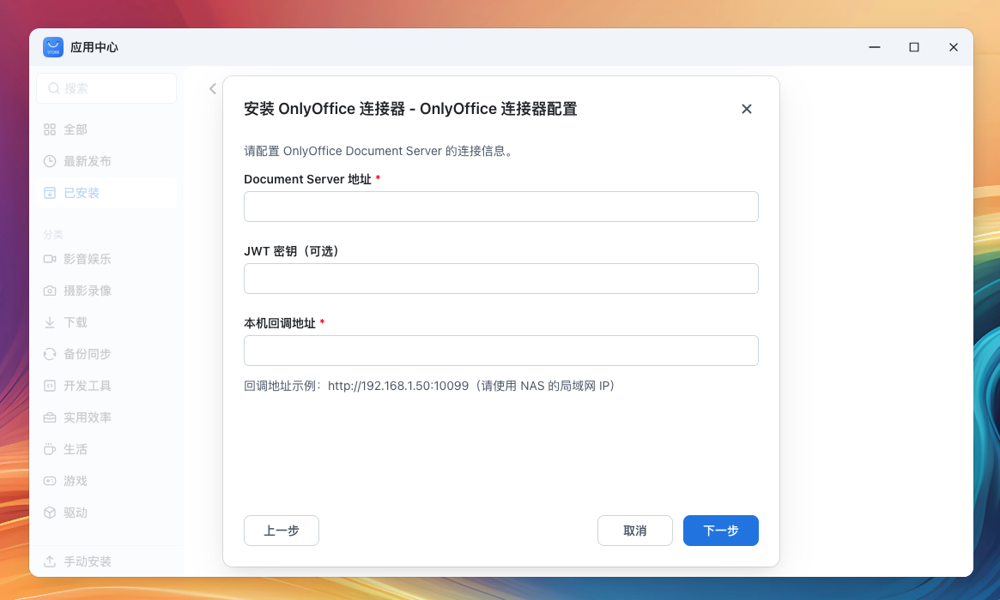

# OnlyOffice fnOS Connector

在浏览器中直接编辑 NAS 上的 Office 文档。支持 DOCX、XLSX、PPTX 等格式的在线编辑，以及 DOC、XLS、PPT、ODT、ODS、ODP 等格式的转换和查看。



## 功能特性

- **在线编辑**: 直接在浏览器中编辑 DOCX、XLSX、PPTX 文档
- **格式转换**: 自动将旧格式 (DOC/XLS/PPT) 转换为 OOXML 格式
- **文档查看**: 支持 PDF、EPUB、FB2 等格式的在线预览
- **JWT 安全**: 支持 JWT 签名验证，确保文档传输安全
- **fnOS 集成**: 专为飞牛 NAS (fnOS) 设计的应用连接器

## ⚠️ 已知限制

由于当前 fnOS 平台的限制，存在以下问题：

1. **无法获取编辑用户信息**: fnOS 暂未提供用户系统接入 API，因此无法识别和显示当前编辑文档的用户身份
2. **飞牛 APP 不支持**: 由于飞牛 APP 的代理机制与 Web 端存在差异，目前无法在 APP 中使用本连接器

**可正常使用的场景**:
- ✅ fnOS Web 端文件管理器
- ✅ 自建反向代理访问
- ❌ 飞牛 APP

## 支持的文件格式

| 类型 | 可编辑 | 可转换 | 仅查看 |
|------|--------|--------|--------|
| 文档 | docx | doc, odt, rtf, txt | pdf, djvu, oxps, epub, fb2 |
| 表格 | xlsx | xls, ods, csv | - |
| 演示 | pptx | ppt, odp | - |

## 安装部署

提供两种安装方式，根据你的需求选择：

---

### 方式一：FPK 安装

分别安装 Connector 和 Document Server，适合已有 Docker 环境或需要自定义配置的用户。

#### 1. 部署 OnlyOffice Document Server

在 fnOS 的 Docker 管理中创建容器，或使用 SSH 执行：

```yaml
# docker-compose.yml
services:
  onlyoffice-documentserver:
    image: onlyoffice/documentserver:latest
    container_name: onlyoffice-documentserver
    environment:
      - JWT_ENABLED=true
      - JWT_SECRET=your-secret-key-change-me  # 请修改为你自己的密钥
      - JWT_HEADER=Authorization
      - JWT_IN_BODY=true
    ports:
      - "10098:80"
    restart: always
    stop_grace_period: 60s
    volumes:
      - ./volumes/data:/var/www/onlyoffice/Data
      - ./volumes/log:/var/log/onlyoffice
      - ./volumes/lib:/var/lib/onlyoffice
      - ./volumes/plugins:/var/www/onlyoffice/documentserver/sdkjs-plugins
      - ./volumes/fonts:/usr/share/fonts/truetype/custom
```

```bash
docker compose up -d
```

#### 2. 安装 OnlyOffice Connector

1. 前往 [Releases](https://github.com/tf4fun/onlyoffice-fnos/releases) 下载最新的 `.fpk` 安装包
2. 在 fnOS 应用中心选择「手动安装」，上传 `.fpk` 文件
3. 安装完成后打开应用进行配置

#### 3. 配置连接器

在连接器设置页面填写：

| 配置项 | 说明 | 示例 |
|--------|------|------|
| Document Server URL | Document Server 地址 | `http://your-nas-ip:10098` |
| JWT Secret | 与 Document Server 的 JWT_SECRET 一致 | `your-secret-key-change-me` |
| Base URL | 连接器回调地址 | `http://your-nas-ip:10099` |

---

### 方式二：Docker Compose 一键安装

使用 WatchCow 通过 compose.yaml 一次性部署 Connector 和 Document Server。

#### 1. 创建 compose.yaml

```yaml
networks:
  onlyoffice-net:
    name: onlyoffice-net
    driver: bridge

services:
  onlyoffice-connector:
    image: xingheliufang/onlyoffice-fnos:main
    container_name: onlyoffice-connector
    networks:
      - onlyoffice-net
    restart: unless-stopped
    depends_on:
      - onlyoffice-documentserver
    environment:
      - DOCUMENT_SERVER_URL=http://onlyoffice-documentserver
      - DOCUMENT_SERVER_SECRET=your-secret-key-change-me  # 请修改
      - BASE_URL=http://onlyoffice-connector:10099
    ports:
      - '10099:10099'
    volumes:
      - /vol1:/vol1  # 根据实际存储卷调整
    labels:
      watchcow.enable: "true"
      watchcow.editor.service_port: "10099"
      watchcow.editor.protocol: "http"
      watchcow.editor.path: "/editor"
      watchcow.editor.ui_type: "iframe"
      watchcow.editor.all_users: "true"
      watchcow.editor.title: "使用 OnlyOffice 打开"
      watchcow.editor.file_types: "docx,xlsx,pptx,doc,xls,ppt,odt,ods,odp,pdf,txt,rtf,csv,djvu,oxps,epub,fb2"
      watchcow.editor.icon: "file://onlyoffice.png"
      watchcow.editor.no_display: "true"

  onlyoffice-documentserver:
    image: onlyoffice/documentserver:latest
    container_name: onlyoffice-documentserver
    networks:
      - onlyoffice-net
    restart: unless-stopped
    stop_grace_period: 60s
    environment:
      - JWT_ENABLED=true
      - JWT_SECRET=your-secret-key-change-me  # 与 connector 保持一致
      - JWT_HEADER=Authorization
      - JWT_IN_BODY=true
    volumes:
      - ./volumes/data:/var/www/onlyoffice/Data
      - ./volumes/log:/var/log/onlyoffice
      - ./volumes/lib:/var/lib/onlyoffice
      - ./volumes/plugins:/var/www/onlyoffice/documentserver/sdkjs-plugins
      - ./volumes/fonts:/usr/share/fonts/truetype/custom
```

#### 2. 部署

将 compose.yaml 放入 fnOS 的 Docker 项目目录，通过 WatchCow 或命令行启动：

```bash
docker compose up -d
```

#### 3. 配置存储卷

根据你的 fnOS 存储配置，修改 `volumes` 挂载路径，确保 connector 能访问到需要编辑的文件。

---

## 使用方法

配置完成后，在 fnOS 文件管理器中右键点击 Office 文档，选择「使用 OnlyOffice 打开」即可在浏览器中编辑。

## 项目结构

```
.
├── cmd/server/          # 主程序入口
├── internal/
│   ├── config/          # 配置管理
│   ├── editor/          # 编辑器配置生成
│   ├── file/            # 文件服务
│   ├── format/          # 格式管理
│   ├── jwt/             # JWT 签名验证
│   └── server/          # HTTP 服务器
├── web/
│   ├── static/          # 静态资源
│   └── templates/       # HTML 模板
└── fnos.onlyoffice-connector/  # fnOS 应用包
```

## 开发

```bash
# 编译
go build -o onlyoffice-connector ./cmd/server

# 运行测试
go test ./...
```

## 许可证

MIT License

## 致谢

- [OnlyOffice Document Server](https://github.com/ONLYOFFICE/DocumentServer)
- [飞牛 NAS (fnOS)](https://www.fnnas.com/)
